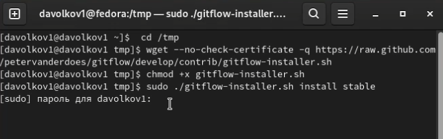
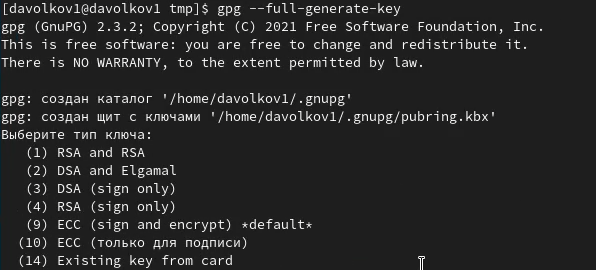
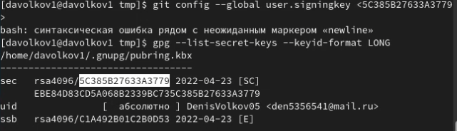
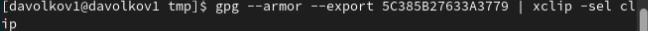
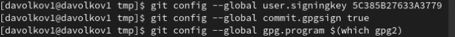
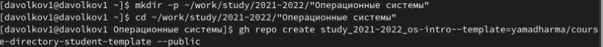
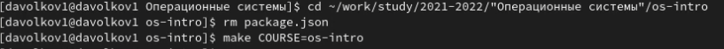
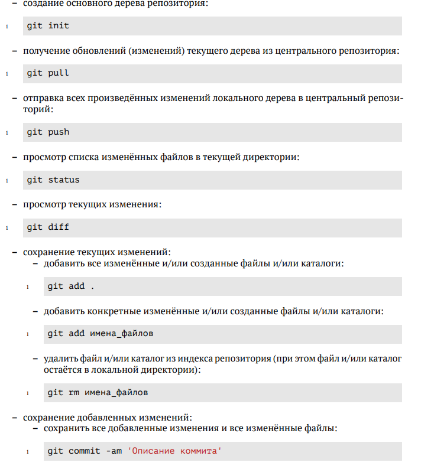

---
## Front matter
title: "Отчет к лабораторной работе №2"
subtitle: "Управление версиями"
author: "Волков Денис Александрович"

## Generic otions
lang: ru-RU
toc-title: "Содержание"

## Bibliography
bibliography: bib/cite.bib
csl: pandoc/csl/gost-r-7-0-5-2008-numeric.csl

## Pdf output format
toc: true # Table of contents
toc-depth: 2
lof: true # List of figures
lot: true # List of tables
fontsize: 12pt
linestretch: 1.5
papersize: a4
documentclass: scrreprt
## I18n polyglossia
polyglossia-lang:
  name: russian
  options:
	- spelling=modern
	- babelshorthands=true
polyglossia-otherlangs:
  name: english
## I18n babel
babel-lang: russian
babel-otherlangs: english
## Fonts
mainfont: PT Serif
romanfont: PT Serif
sansfont: PT Sans
monofont: PT Mono
mainfontoptions: Ligatures=TeX
romanfontoptions: Ligatures=TeX
sansfontoptions: Ligatures=TeX,Scale=MatchLowercase
monofontoptions: Scale=MatchLowercase,Scale=0.9
## Biblatex
biblatex: true
biblio-style: "gost-numeric"
biblatexoptions:
  - parentracker=true
  - backend=biber
  - hyperref=auto
  - language=auto
  - autolang=other*
  - citestyle=gost-numeric
## Pandoc-crossref LaTeX customization
figureTitle: "Рис."
tableTitle: "Таблица"
listingTitle: "Листинг"
lofTitle: "Список иллюстраций"
lotTitle: "Список таблиц"
lolTitle: "Листинги"
## Misc options
indent: true
header-includes:
  - \usepackage{indentfirst}
  - \usepackage{float} # keep figures where there are in the text
  - \floatplacement{figure}{H} # keep figures where there are in the text
---
# Цели работы 
Изучить идеологию и применение средств контроля версий, а также освоить умения по работе с git.

# Выполнение работы
1. Установка git-flow 



2. Установка gh 


3. Базовая настройка git
```
git config --global user.name "Name Surname" 
git config --global user.email "work@mail"
git config --global core.quotepath false
git config --global init.defaultBranch master
git config --global core.autocrlf input
git config --global core.safecrlf warn
```
С помощью данных команд зададим имя и email, настроим utf8, зададим имя начальной ветки, а также параметры autocrlf и safecrlf.

4. Создаем ключи ssh с помощью команд
```
sh-keygen -t rsa -b 4096
```
и
```
ssh-keygen -t ed25519
```
5. Создаем ключи pgp 



6. Добавление PGP ключа в GitHub 

 



7. Настраиваем автоматическую подпись коммитов 



8. С помощью команды gh auth login авторизуемся и создаем репозиторий курса на основе шаблона  



9.  Настраиваем каталог курса 



И с помощью данных команд
```
git add .
git commit -am 'feat(main): make course structure'
git push
```
отправляем файлы на сервер.

# Выводы
В ходе выполнения данной лабораторной работы изучили идеологию и применение средств контроля версий, а также освоили умения по работе с git.

# Контрольные вопросы
1.VCS – это программное обеспечение для облегчения работы с изменяющейся информацией, применяется при работе группы людей над одним проектом.

2.Хранилище – это место хранения всех версий и служебной информации

Commit – это процесс создания новой версии 

История – это информация по изменениям, внесенным в проект

Рабочая копия – это текущее состояние файлов, основанное на версии, загруженной из хранилища.

3.Централизованные были созданы для бэкапирования, отслеживания и синхронизации файлов, а также все изменения в ней проходят через центральный сервер. Примеры: CVS, Subversion

Децентрализованные были созданы для обмена изменениями, и у каждого есть свой полноценный репозиторий. И у децентрализованных нет такой жестко заданной структуры репозиториев с центральным сервером. Примеры: Git, Bazaar, Mercurial.

6.Есть 2 основные задачи: хранение информации о всех изменениях в коде и обеспечение удобства командной работы

7.Список команд



8.Если вы захотите продолжить работу над проектом на другом устройстве то вам понадобится удаленный репозиторий.

9.При работе нескольких человек над одним проектом, ветви будут нужны чтобы они могли спокойно работать, не мешая при этом друг другу.

10.Игнорируемые файлы – это обычно артефакты сборки или файлы, генерируемые машиной из исходных файлов в репозитории или же файлы которые не должны попасть в коммиты. 