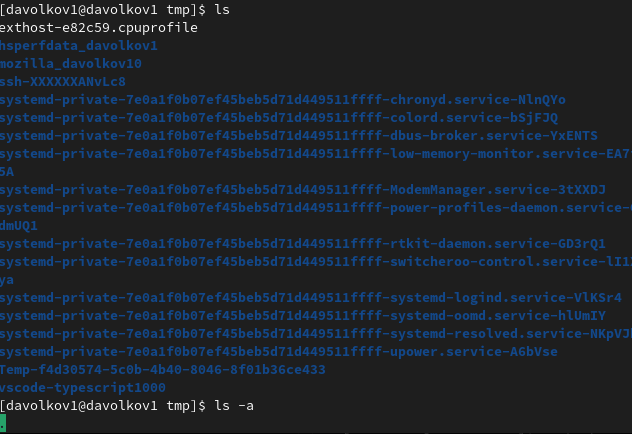
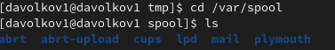
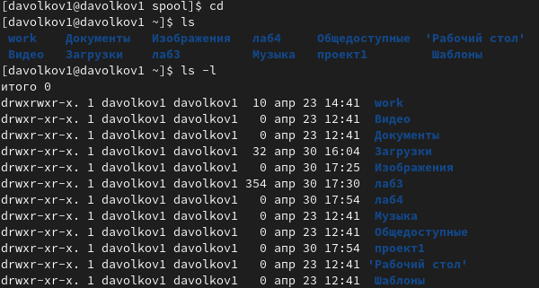
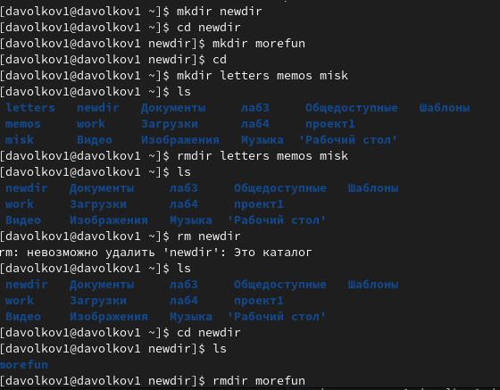
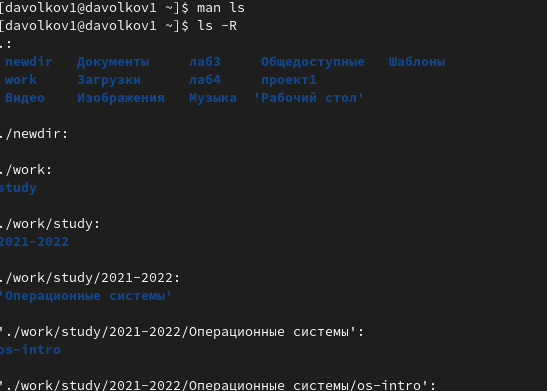
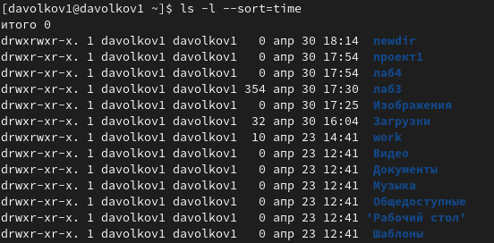
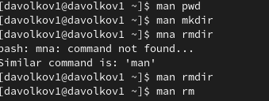
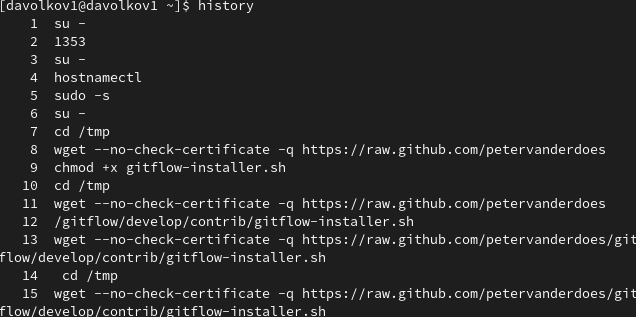
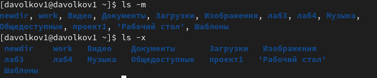

---
## Front matter
title: "Презентация к лабораторной работе №4"
subtitle: "Основы интерфейса взаимодействия пользователя с системой Unix на уровне командной строки"
author: "Волков Денис Александрович"

## Generic otions
lang: ru-RU
toc-title: "Содержание"

## Bibliography
bibliography: bib/cite.bib
csl: pandoc/csl/gost-r-7-0-5-2008-numeric.csl

## Pdf output format
toc: true # Table of contents
toc-depth: 2
lof: true # List of figures
lot: true # List of tables
fontsize: 12pt
linestretch: 1.5
papersize: a4
documentclass: scrreprt
## I18n polyglossia
polyglossia-lang:
  name: russian
  options:
	- spelling=modern
	- babelshorthands=true
polyglossia-otherlangs:
  name: english
## I18n babel
babel-lang: russian
babel-otherlangs: english
## Fonts
mainfont: PT Serif
romanfont: PT Serif
sansfont: PT Sans
monofont: PT Mono
mainfontoptions: Ligatures=TeX
romanfontoptions: Ligatures=TeX
sansfontoptions: Ligatures=TeX,Scale=MatchLowercase
monofontoptions: Scale=MatchLowercase,Scale=0.9
## Biblatex
biblatex: true
biblio-style: "gost-numeric"
biblatexoptions:
  - parentracker=true
  - backend=biber
  - hyperref=auto
  - language=auto
  - autolang=other*
  - citestyle=gost-numeric
## Pandoc-crossref LaTeX customization
figureTitle: "Рис."
tableTitle: "Таблица"
listingTitle: "Листинг"
lofTitle: "Список иллюстраций"
lotTitle: "Список таблиц"
lolTitle: "Листинги"
## Misc options
indent: true
header-includes:
  - \usepackage{indentfirst}
  - \usepackage{float} # keep figures where there are in the text
  - \floatplacement{figure}{H} # keep figures where there are in the text
---

# **Цель работы** 
## Приобретение практических навыков взаимодействия пользователя с системой посредством командной строки.

# **Выполнение работы**
## С помощью команды pwd определяем имя домашнего каталога[1](#example)

## Выполняем следующие действия:
### Переходим в каталог /tmp

### Выводим содержимое с различными функциями

### Проверяем естл ли в каталоге /var/spool подкаталог с именем cron (его там нет)

### Смотрим владельца папок домашнего каталога 

## Выполняем следующие действия 

## Определяем с помощью команды man и используем опцию -R

## Определяем с помощью команды man и используем опции для сортировки по вермени и вывода с развернутым описанием

## С помощью man смотрим описание команд: cd;pwd;mkdir;rmdir;rm

## Смотрим историю команд и выполняем модификацию и исполнение нескольких команд

# **Вывод**
## В результате лабораторной работы №4 мы приобрели практические навыки взаимодействия пользователя с системой посредством командной строки.