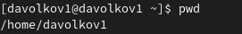
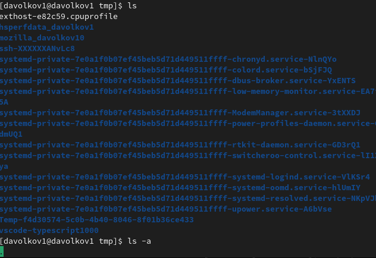
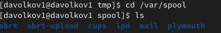
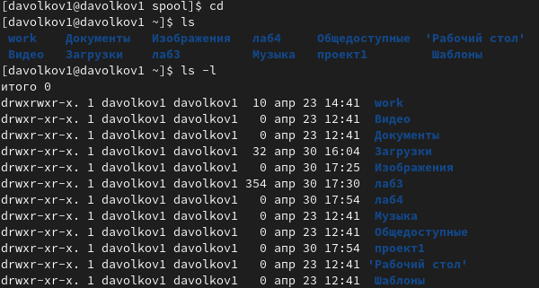
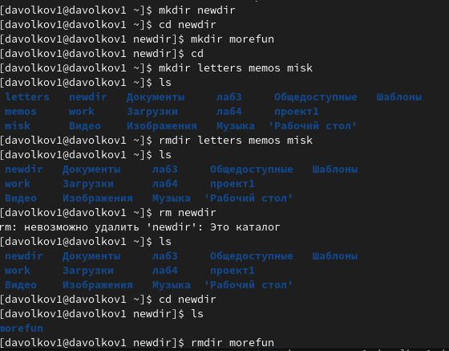
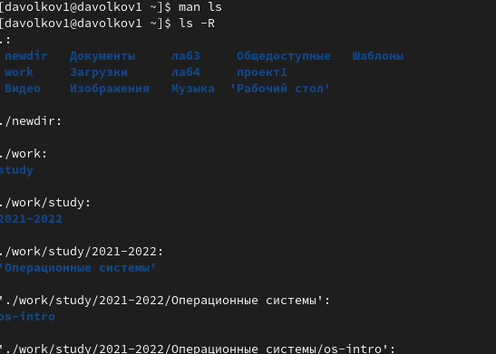
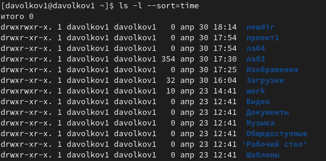
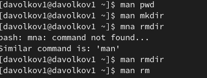
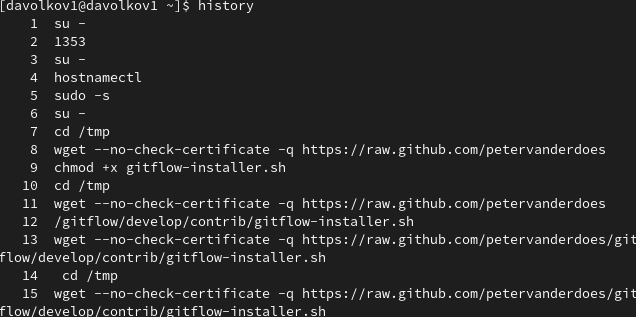
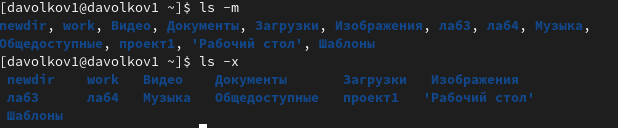

---
## Front matter
title: "Отчет к лабораторной работе №4"
subtitle: "Основы интерфейса взаимодействия пользователя с системой Unix на уровне командной строки"
author: "Волков Денис Александрович"

## Generic otions
lang: ru-RU
toc-title: "Содержание"

## Bibliography
bibliography: bib/cite.bib
csl: pandoc/csl/gost-r-7-0-5-2008-numeric.csl

## Pdf output format
toc: true # Table of contents
toc-depth: 2
lof: true # List of figures
lot: true # List of tables
fontsize: 12pt
linestretch: 1.5
papersize: a4
documentclass: scrreprt
## I18n polyglossia
polyglossia-lang:
  name: russian
  options:
	- spelling=modern
	- babelshorthands=true
polyglossia-otherlangs:
  name: english
## I18n babel
babel-lang: russian
babel-otherlangs: english
## Fonts
mainfont: PT Serif
romanfont: PT Serif
sansfont: PT Sans
monofont: PT Mono
mainfontoptions: Ligatures=TeX
romanfontoptions: Ligatures=TeX
sansfontoptions: Ligatures=TeX,Scale=MatchLowercase
monofontoptions: Scale=MatchLowercase,Scale=0.9
## Biblatex
biblatex: true
biblio-style: "gost-numeric"
biblatexoptions:
  - parentracker=true
  - backend=biber
  - hyperref=auto
  - language=auto
  - autolang=other*
  - citestyle=gost-numeric
## Pandoc-crossref LaTeX customization
figureTitle: "Рис."
tableTitle: "Таблица"
listingTitle: "Листинг"
lofTitle: "Список иллюстраций"
lotTitle: "Список таблиц"
lolTitle: "Листинги"
## Misc options
indent: true
header-includes:
  - \usepackage{indentfirst}
  - \usepackage{float} # keep figures where there are in the text
  - \floatplacement{figure}{H} # keep figures where there are in the text
---
# Цель работы 
Приобретение практических навыков взаимодействия пользователя с системой посредством командной строки.

# Выполнение работы
1.С помощью команды pwd определяем имя домашнего каталога[1](#example)



2.Выполняем следующие действия
2.1 Переходим в каталог /tmp


2.2 Выводим содержимое с различными функциями



2.3 Проверяем естл ли в каталоге /var/spool подкаталог с именем cron (его там нет)



2.4 Смотрим владельца папок домашнего каталога 



3.Выполняем следующие действия 



4.Определяем с помощью команды man и используем опцию -R



5.Определяем с помощью команды man и используем опции для сортировки по вермени и вывода с развернутым описанием



6.С помощью man смотрим описание команд: cd;pwd;mkdir;rmdir;rm



7.Смотрим историю команд и выполняем модификацию и исполнение нескольких команд





# Вывод
В результате лабораторной работы №4 мы приобрели практические навыки взаимодействия пользователя с системой посредством командной строки.

# Ответы на контрольные вопросы 
1. Командная строка – это специальная программа, которая позволяет управлять компьютером путем ввода текстовых команд с клавиатуры.
2. С помощью команды pwd можем определить абсолютный путь (см. пункт 1)
3. С помощью ls -F мы можем определить имя и тип файла (ls -F newdir)
4. С помощью ls -a мы можем отобразить скрытые файлы (см. пункт 2.2)
5. Команды rm, rmdir (в пункте 3 видно что rmdir не может удалить не пустой каталог)
6. Команда history выводит список последних команд
7. ```!<номер_команды>:s/<что_меняем>/<на_что_меняем>``` (например ``` !3:s/a/F ``` затем ```2 ls -F ```)
8. С помощью символа ' ; ' можем выполнять несколько команд (cd; ls)
9. Экранирование символов — замена в тексте управляющих символов на соответствующие текстовые подстановки.(используем \ перед символом (!3:s/awd\./F))
10. – тип файла,
– право доступа,
– число ссылок,
– владелец,
– размер,
– дата последней ревизии,
– имя файла или каталога.
11. Относительный путь к файлу от документа — это путь к файлу относительно текущего документа. Такой адрес зависит от расположения файла, в котором он записан. (cd~ и cd /home/davolkov1 приведут нас в домашний каталог)
12. С помощью команды man можно получить информацию по командам 
13. Клавиша Tab может помочь с дополнением команд 