---
## Front matter
lang: ru-RU
title: Анализ файловой системы Linux. Команды для работы с файлами и каталогами
author: |
  Волков Денис Александрович, НПИ-01-21, 1032216533
institute: |
	\inst{1}RUDN University, Moscow, Russian Federation
date: 07 May, 2022

## Formatting
toc: false
slide_level: 2
theme: metropolis
header-includes: 
 - \metroset{progressbar=frametitle,sectionpage=progressbar,numbering=fraction}
 - '\makeatletter'
 - '\beamer@ignorenonframefalse'
 - '\makeatother'
aspectratio: 43
section-titles: true
---

## Цель работы 
Ознакомление с файловой системой Linux, её структурой, именами и содержанием
каталогов. Приобретение практических навыков по применению команд для работы
с файлами и каталогами, по управлению процессами (и работами), по проверке использования диска и обслуживанию файловой системы.

## Выполнение работы
* Выполняем все примеры, приведённые в первой части описания лабораторной работы.

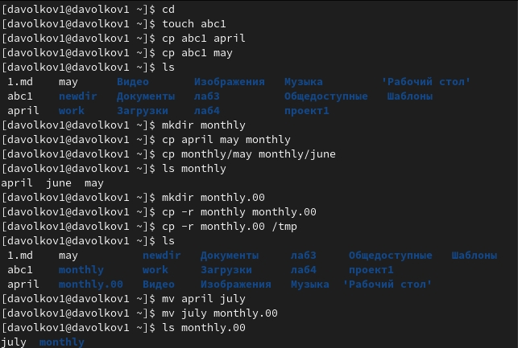

## Выполнение работы

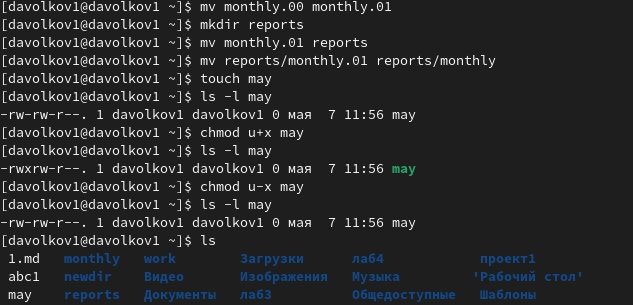

## Выполнение работы
* Выполняем следующие действия 
Используем команду cp для копирования файла, mkdir для сохдания каталога и mv для перемещения 

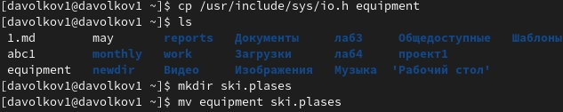

## Выполнение работы
* Используем mv для переимеовывания и перемещения файлов, а с помощью команды touch создаем файлы

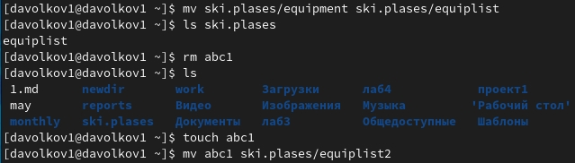

## Выполнение работы
* Используем mkdir для создания каталогов и mv для перемещений

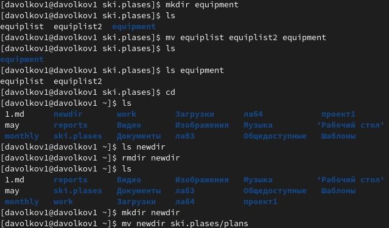

## Выполнение работы
* Присваиваем права выделенным файлам  
Создаем нужные директории и файлы 

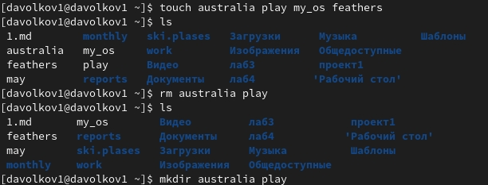

## Выполнение работы
* Присваиваем нужные права директориям

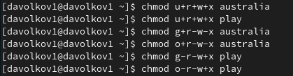

## Выполнение работы
* Присваиваем необходимые права файлам

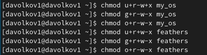

## Выполнение работы
* Выполняем приведенные упражнения  
* С помощью cat смотрим содержимое passwd(т.к. файла password нет)

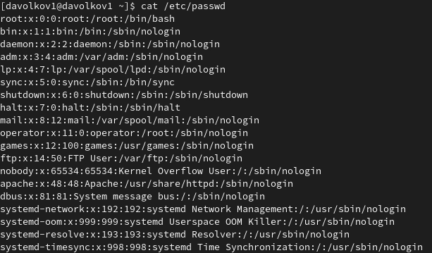

## Выполнение работы
* Используем cp и mv для выполнения следующих действий (используем опцию -r для рекурсивного копирования)

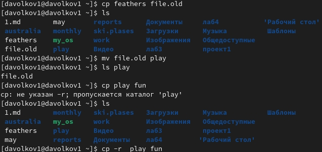

## Выполнение работы
* Перемещаем файл и лишаем доступа на чтение

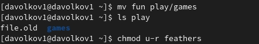

## Выполнение работы
* Пытаемся просмотреть или скопировать файл и видим ошибку, затем лишаем владельца каталога ~/play прав на выполнение и видим ошибку при перемещении в этот каталог

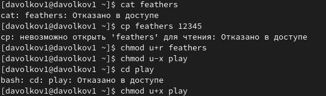

## Выполнение работы
* Используем команду man и изучаем использование команд mount, fsck, mkfs, kill.

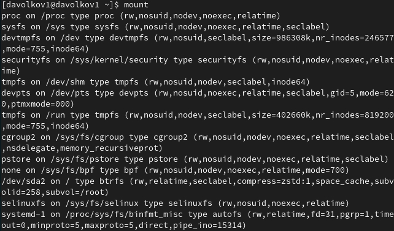

## Выполнение работы

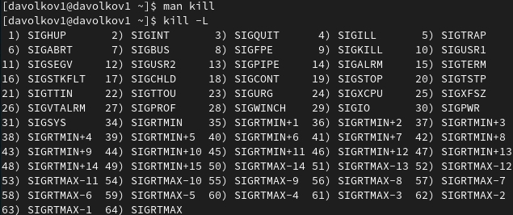

## Вывод 
Мы ознакомились с файловой системой Linux, её структурой, именами и содержанием
каталогов, а также приобрели практические навыков по применению команд для работы
с файлами и каталогами, по управлению процессами (и работами), по проверке использования диска и обслуживанию файловой системы.