---
## Front matter
title: "Отчет к лабораторной работе №5"
subtitle: "Анализ файловой системы Linux.
Команды для работы с файлами и каталогами"
author: "Волков Денис Александрович"

## Generic otions
lang: ru-RU
toc-title: "Содержание"

## Bibliography
bibliography: bib/cite.bib
csl: pandoc/csl/gost-r-7-0-5-2008-numeric.csl

## Pdf output format
toc: true # Table of contents
toc-depth: 2
lof: true # List of figures
lot: true # List of tables
fontsize: 12pt
linestretch: 1.5
papersize: a4
documentclass: scrreprt
## I18n polyglossia
polyglossia-lang:
  name: russian
  options:
	- spelling=modern
	- babelshorthands=true
polyglossia-otherlangs:
  name: english
## I18n babel
babel-lang: russian
babel-otherlangs: english
## Fonts
mainfont: PT Serif
romanfont: PT Serif
sansfont: PT Sans
monofont: PT Mono
mainfontoptions: Ligatures=TeX
romanfontoptions: Ligatures=TeX
sansfontoptions: Ligatures=TeX,Scale=MatchLowercase
monofontoptions: Scale=MatchLowercase,Scale=0.9
## Biblatex
biblatex: true
biblio-style: "gost-numeric"
biblatexoptions:
  - parentracker=true
  - backend=biber
  - hyperref=auto
  - language=auto
  - autolang=other*
  - citestyle=gost-numeric
## Pandoc-crossref LaTeX customization
figureTitle: "Рис."
tableTitle: "Таблица"
listingTitle: "Листинг"
lofTitle: "Список иллюстраций"
lotTitle: "Список таблиц"
lolTitle: "Листинги"
## Misc options
indent: true
header-includes:
  - \usepackage{indentfirst}
  - \usepackage{float} # keep figures where there are in the text
  - \floatplacement{figure}{H} # keep figures where there are in the text
---
# Цель работы 
Ознакомление с файловой системой Linux, её структурой, именами и содержанием
каталогов. Приобретение практических навыков по применению команд для работы
с файлами и каталогами, по управлению процессами (и работами), по проверке использования диска и обслуживанию файловой системы.

# Выполнение работы
1.Выполняем все примеры, приведённые в первой части описания лабораторной работы.

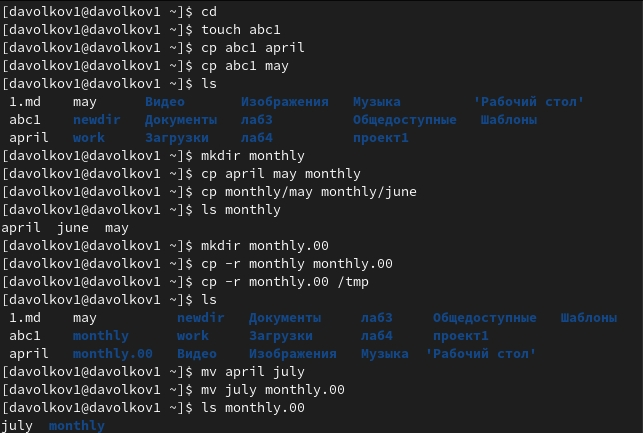

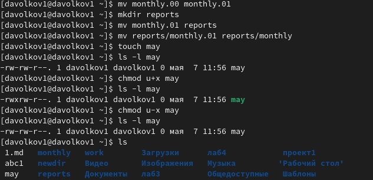

2.Выполняем следующие действия 
Используем команду cp для копирования файла, mkdir для сохдания каталога и mv для перемещения 

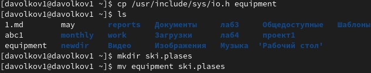

Используем mv для переимеовывания и перемещения файлов, а с помощью команды touch создаем файлы

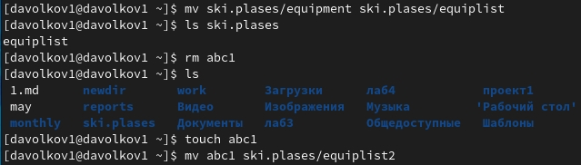

Используем mkdir для создания каталогов и mv для перемещений

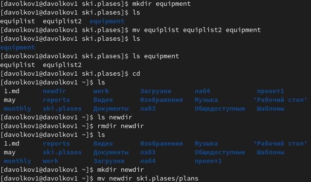

3.Присваиваем права выделенным файлам  
Создаем нужные директории и файлы 

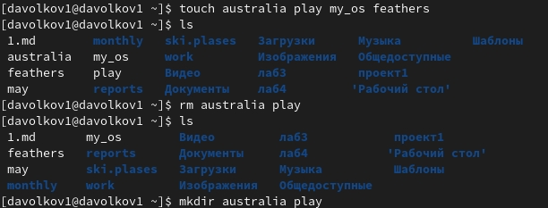

Присваиваем нужные права директориям

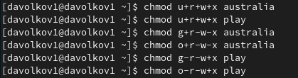

Присваиваем необходимые права файлам

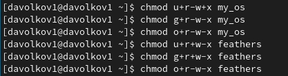

4.Выполняем приведенные упражнения  
С помощью cat смотрим содержимое passwd(т.к. файла password нет)

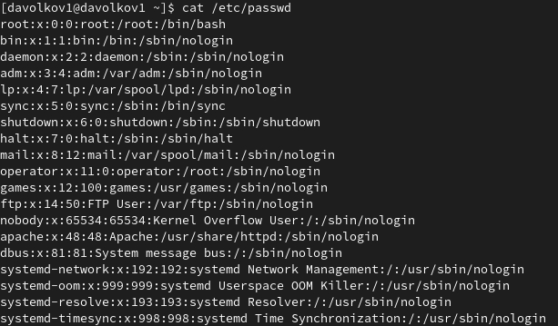

Используем cp и mv для выполнения следующих действий (используем опцию -r для рекурсивного копирования)

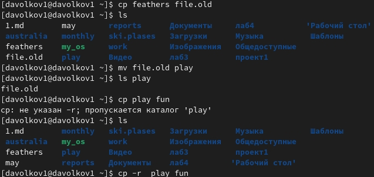

Перемещаем файл и лишаем доступа на чтение

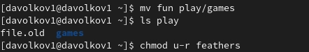

Пытаемся просмотреть или скопировать файл и видим ошибку, затем лишаем владельца каталога ~/play прав на выполнение и видим ошибку при перемещении в этот каталог

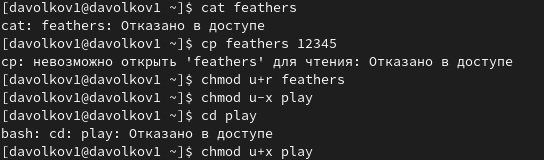

5.Используем команду man и изучаем использование команд mount, fsck, mkfs, kill.

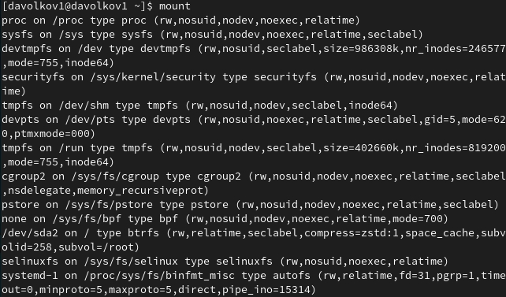

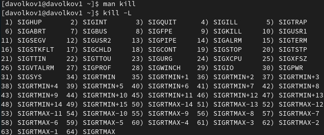

# Вывод 
Мы ознакомились с файловой системой Linux, её структурой, именами и содержанием
каталогов, а также приобрели практические навыков по применению команд для работы
с файлами и каталогами, по управлению процессами (и работами), по проверке использования диска и обслуживанию файловой системы.

# Контрольные вопросы 
1. Ext2, Ext3, Ext4 или Extended Filesystem - это стандартная файловая система для Linux. Она была разработана еще для Minix. Она самая стабильная из всех существующих, кодовая база изменяется очень редко и эта файловая система содержит больше всего функций. Версия ext2 была разработана уже именно для Linux и получила много улучшений. В 2001 году вышла ext3, которая добавила еще больше стабильности благодаря использованию журналирования. В 2006 была выпущена версия ext4, которая используется во всех дистрибутивах Linux до сегодняшнего дня. В ней было внесено много улучшений, в том числе увеличен максимальный размер раздела до одного экзабайта. 
ReiserFS - была разработана намного позже, в качестве альтернативы ext3 с улучшенной производительностью и расширенными возможностями. Она была разработана под руководством Ганса Райзера и поддерживает только Linux. Из особенностей можно отметить динамический размер блока, что позволяет упаковывать несколько небольших файлов в один блок, что предотвращает фрагментацию и улучшает работу с небольшими файлами. Еще одно преимущество - в возможности изменять размеры разделов на лету. Но минус в некоторой нестабильности и риске потери данных при отключении энергии. Раньше ReiserFS применялась по умолчанию в SUSE Linux, но сейчас разработчики перешли на Btrfs.
2. / — root каталог. Содержит в себе всю иерархию системы 
/bin — здесь находятся двоичные исполняемые файлы. Основные общие команды, хранящиеся отдельно от других программ в системе 
/boot — тут расположены файлы, используемые для загрузки системы (образ initrd, ядро vmlinuz) 
/etc — в этой директории находятся файлы конфигураций программ. Эти файлы позволяют настраивать системы, сервисы, скрипты системных демонов 
/home — каталог, аналогичный каталогу Users в Windows. Содержит домашние каталоги учетных записей пользователей (кроме root). При создании нового пользователя здесь создается одноименный каталог с аналогичным именем и хранит личные файлы этого пользователя
3. Монтирование тома
4. Отсутствие синхронизации между образом файловой системы в памяти и ее данными на диске в случае аварийного останова может привести к появлению следующих ошибок: Один блок адресуется несколькими mode (принадлежит нескольким файлам); Блок помечен как занятый, но в то же время свободен (ни один inode на него не ссылается); Недопустимые адресуемые блоки (например, расположенные за пределами файловой системы). 
Можем использовать команду fsck для проверки целостности файловой системы.
5. mkfs - позволяет создать файловую систему Linux.
6. Cat - выводит содержимое файла на стандартное устройство вывода
7. Cp – копирует или перемещает директорию, файлы.
8. Mv - переименовать или переместить файл или директорию
9. Права доступа - это разграничения полномочий пользователей, работающих в системе. Права доступа к файлу или каталогу можно изменить, воспользовавшись командой chmod. Сделать это может владелец файла (или каталога) или пользователь с правами администратора.