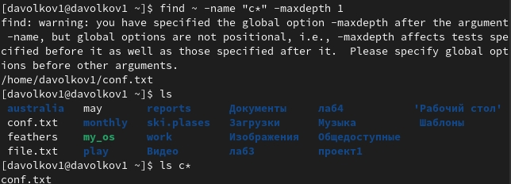

---
## Front matter
lang: ru-RU
title: Поиск файлов. Перенаправление ввода-вывода. Просмотр запущенных процессов
author: |
  Волков Денис Александрович, НПИ-01-21, 1032216533
institute: |
	\inst{1}RUDN University, Moscow, Russian Federation
date: 07 May, 2022

## Formatting
toc: false
slide_level: 2
theme: metropolis
header-includes: 
 - \metroset{progressbar=frametitle,sectionpage=progressbar,numbering=fraction}
 - '\makeatletter'
 - '\beamer@ignorenonframefalse'
 - '\makeatother'
aspectratio: 43
section-titles: true
---

## Цель работы 
Ознакомление с инструментами поиска файлов и фильтрации текстовых данных.
Приобретение практических навыков: по управлению процессами (и заданиями), по
проверке использования диска и обслуживанию файловых систем.

## Выполнение работы
1.Осуществляем вход в системы как мы это делаем обычно 
2.Запишем в файл file.txt названия файлов, содержащихся в каталоге /etc. Также допишем в этот же файл названия файлов, содержащихся в нашем домашнем каталоге.

## Выполнение работы
3.Выведим имена всех файлов из file.txt, имеющих расширение .conf, после чего
запишем их в новый текстовой файл conf.txt.

## Выполнение работы
4.Определить, какие файлы в нашем домашнем каталоге имеют имена, начинавшиеся
с символа c? Предложить несколько вариантов, как это сделать.

## Выполнение работы
5.Выведем на экран (по странично) имена файлов из каталога /etc, начинающиеся
с символа h.

## Выполнение работы
6.Запустим в фоновом режиме процесс, который будет записывать в файл ~/logfile
файлы, имена которых начинаются с log.

## Выполнение работы
7.Удалим файл ~/logfile.

## Выполнение работы
8.Запустим из консоли в фоновом режиме редактор gedit.

## Выполнение работы
9.Определим идентификатор процесса gedit, используя команду ps, конвейер и фильтр
grep. Как ещё можно определить идентификатор процесса?(Можем определить идентификатор процесса к примеру через инструмент glances)

## Выполнение работы
10.Прочтем справку (man) команды kill, после чего используем её для завершения
процесса gedit.

## Выполнение работы

## Выполнение работы
11.Выполним команды df и du, предварительно получив более подробную информацию
об этих командах, с помощью команды man.

## Выполнение работы

## Выполнение работы

## Выполнение работы
12.Воспользовавшись справкой команды find, выведем имена всех директорий, имеющихся в нашем домашнем каталоге.

## Выполнение работы

## Вывод 
В результате данной лабораторной работы мы ознакомились с инструментами поиска файлов и фильтрации текстовых данных, а также приобрели практические навыкои: по управлению процессами (и заданиями), по проверке использования диска и обслуживанию файловых систем.