---
## Front matter
title: "Отчет к лабораторной работе №6"
subtitle: "Поиск файлов. Перенаправление ввода-вывода. Просмотр запущенных процессов"
author: "Волков Денис Александрович"

## Generic otions
lang: ru-RU
toc-title: "Содержание"

## Bibliography
bibliography: bib/cite.bib
csl: pandoc/csl/gost-r-7-0-5-2008-numeric.csl

## Pdf output format
toc: true # Table of contents
toc-depth: 2
lof: true # List of figures
lot: true # List of tables
fontsize: 12pt
linestretch: 1.5
papersize: a4
documentclass: scrreprt
## I18n polyglossia
polyglossia-lang:
  name: russian
  options:
	- spelling=modern
	- babelshorthands=true
polyglossia-otherlangs:
  name: english
## I18n babel
babel-lang: russian
babel-otherlangs: english
## Fonts
mainfont: PT Serif
romanfont: PT Serif
sansfont: PT Sans
monofont: PT Mono
mainfontoptions: Ligatures=TeX
romanfontoptions: Ligatures=TeX
sansfontoptions: Ligatures=TeX,Scale=MatchLowercase
monofontoptions: Scale=MatchLowercase,Scale=0.9
## Biblatex
biblatex: true
biblio-style: "gost-numeric"
biblatexoptions:
  - parentracker=true
  - backend=biber
  - hyperref=auto
  - language=auto
  - autolang=other*
  - citestyle=gost-numeric
## Pandoc-crossref LaTeX customization
figureTitle: "Рис."
tableTitle: "Таблица"
listingTitle: "Листинг"
lofTitle: "Список иллюстраций"
lotTitle: "Список таблиц"
lolTitle: "Листинги"
## Misc options
indent: true
header-includes:
  - \usepackage{indentfirst}
  - \usepackage{float} # keep figures where there are in the text
  - \floatplacement{figure}{H} # keep figures where there are in the text
---

# Цель работы 
Ознакомление с инструментами поиска файлов и фильтрации текстовых данных.
Приобретение практических навыков: по управлению процессами (и заданиями), по
проверке использования диска и обслуживанию файловых систем.

# Выполнение работы
1.Осуществляем вход в системы как мы это делаем обычно<br/>
2.Запишем в файл file.txt названия файлов, содержащихся в каталоге /etc. Также допишем в этот же файл названия файлов, содержащихся в нашем домашнем каталоге.

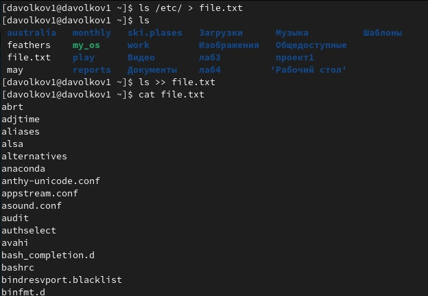

3.Выведим имена всех файлов из file.txt, имеющих расширение .conf, после чего
запишем их в новый текстовой файл conf.txt.

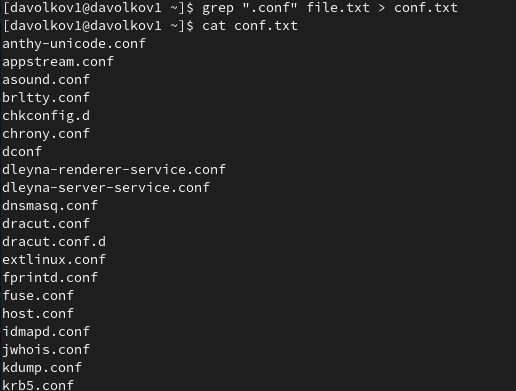

4.Определить, какие файлы в нашем домашнем каталоге имеют имена, начинавшиеся
с символа c? Предложить несколько вариантов, как это сделать.

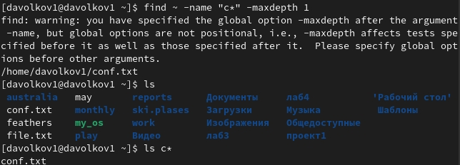

5.Выведем на экран (по странично) имена файлов из каталога /etc, начинающиеся
с символа h.

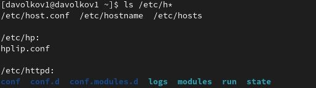

6.Запустим в фоновом режиме процесс, который будет записывать в файл ~/logfile
файлы, имена которых начинаются с log.

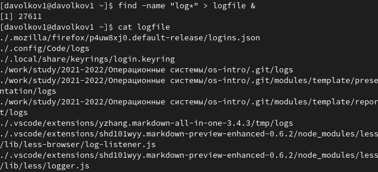

7.Удалим файл ~/logfile.


8.Запустим из консоли в фоновом режиме редактор gedit.

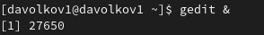

9.Определим идентификатор процесса gedit, используя команду ps, конвейер и фильтр
grep. Как ещё можно определить идентификатор процесса?(Можем определить идентификатор процесса к примеру через инструмент glances)

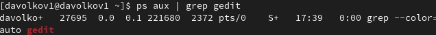

10.Прочтем справку (man) команды kill, после чего используем её для завершения
процесса gedit.

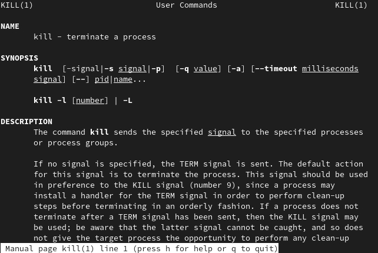

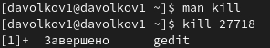

11.Выполним команды df и du, предварительно получив более подробную информацию
об этих командах, с помощью команды man.

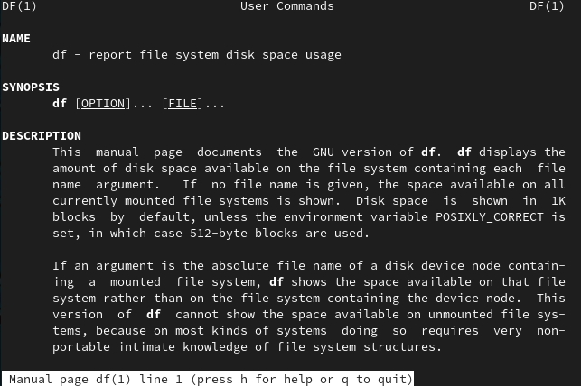

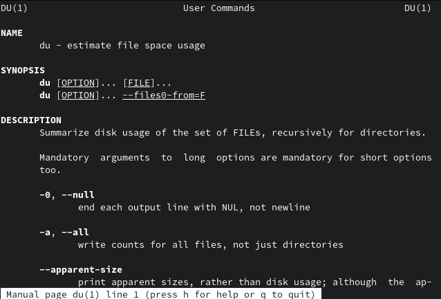

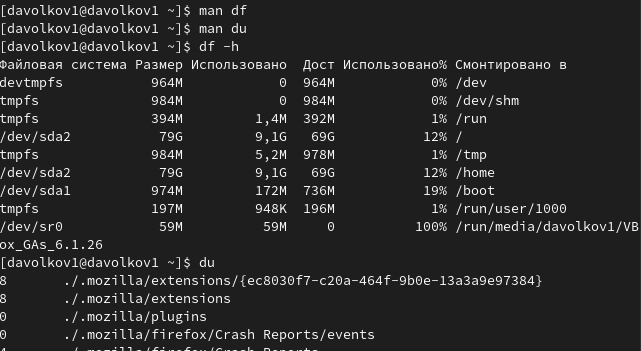

12.Воспользовавшись справкой команды find, выведем имена всех директорий, имеющихся в нашем домашнем каталоге.

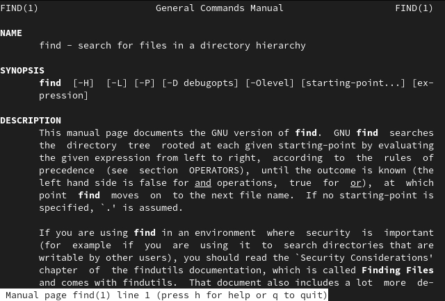

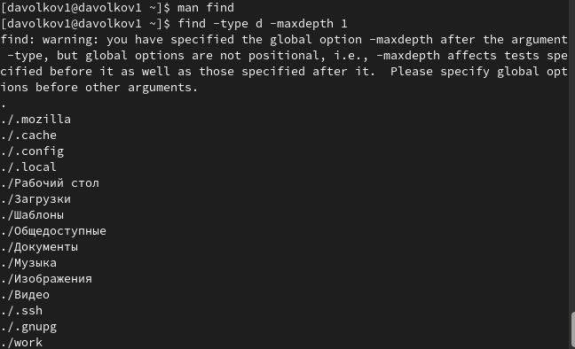


# Вывод 
В результате данной лабораторной работы мы ознакомились с инструментами поиска файлов и фильтрации текстовых данных, а также приобрели практические навыкои: по управлению процессами (и заданиями), по проверке использования диска и обслуживанию файловых систем.

# Контрольные вопросы 
1. Stdin и stdout, stderr
2. Первый перенаправляет, а второй открывает в режиме добавления.
3. Конвейер (pipe) служит для объединения простых команд или утилит в цепочки, в которых результат работы предыдущей команды передаётся последующей.
4. Компьютерная программа сама по себе — лишь пассивная последовательность инструкций. В то время как процесс — непосредственное выполнение этих инструкций. Также, процессом называют выполняющуюся программу и все её элементы: адресное пространство, глобальные переменные, регистры, стек, открытые файлы и так далее.
5. PID – это айди процесса.<br/>
GID - Группы пользователей применяются для организации доступа нескольких пользователей к некоторым ресурсам.
6. Задачи(jobs) - это запущенные фоном программы. Ими можно управлять с помощью команды jobs, которая выводит список запущенных в данный момент задач.
7. Top - отобразить запущенные процессы, используемые ими ресурсы и другую полезную информацию (с автоматическим обновлением данных)<br/>
Htop - показывает динамический список системных процессов, список обычно выравнивается по использованию ЦПУ. В отличие от top, htop показывает все процессы в системе. Также показывает время непрерывной работы, использование процессоров и памяти. Htop часто применяется в тех случаях, когда информации даваемой утилитой top недостаточно, например при поиске утечек памяти в процессах.
8. Команда find используется для поиска и отображения на экран имён файлов, соответствующих заданной строке символов. Формат команды: ``` find путь [-опции] ```  
9. Да, через команду grep. ``` grep строка имя_файла ```
10. Для определения объёма свободного пространства на файловой системе можно воспользоваться командой df, которая выведет на экран список всех файловых систем в соответствии с именами устройств, с указанием размера и точки монтирования.
11. Команда du показывает число килобайт, используемое каждым файлом или каталогом.
12. Можно удалить через kill, написав айди процесса