---
## Front matter
lang: ru-RU
title: Командная оболочка Midnight Commander
author: |
  Волков Денис Александрович, НПИ-01-21, 1032216533
institute: |
	\inst{1}RUDN University, Moscow, Russian Federation
date: 14 May, 2022

## Formatting
toc: false
slide_level: 2
theme: metropolis
header-includes: 
 - \metroset{progressbar=frametitle,sectionpage=progressbar,numbering=fraction}
 - '\makeatletter'
 - '\beamer@ignorenonframefalse'
 - '\makeatother'
aspectratio: 43
section-titles: true
---

## Цель работы 
Освоение основных возможностей командной оболочки Midnight Commander. Приобретение навыков практической работы по просмотру каталогов и файлов; манипуляций
с ними.

# Выполнение работы
## Задание по mc
1.Изучаем информацию о mc, вызвав в командной строке man mc.

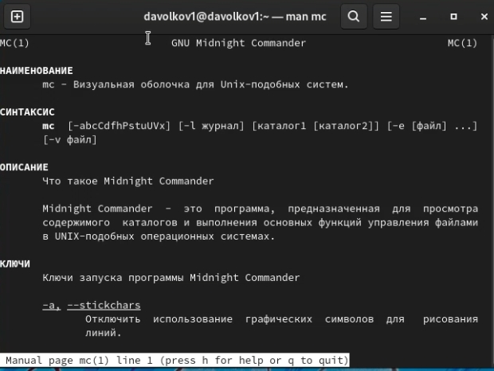

## Задание по mc
2.Запускаем из командной строки mc, изучаем его структуру и меню.

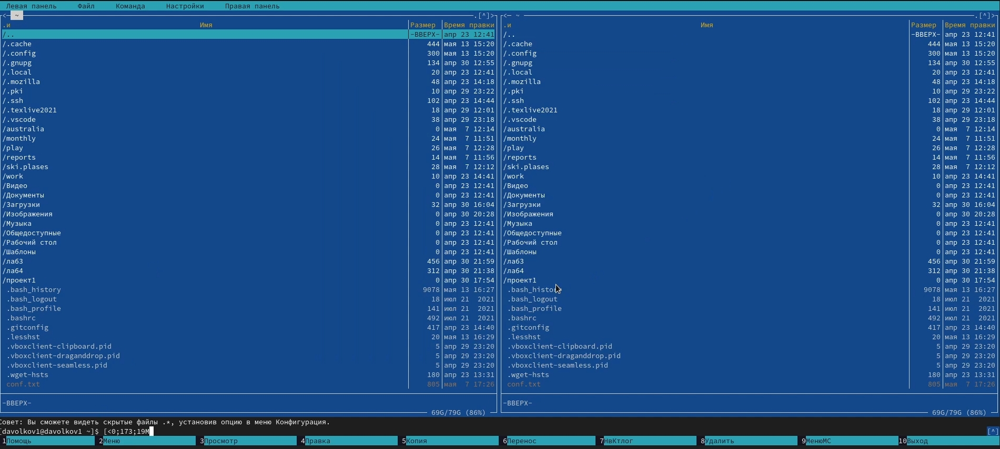

## Задание по mc
3.Выполняем несколько операций в mc, используя управляющие клавиши (операции
с панелями; выделение/отмена выделения файлов, копирование/перемещение файлов, получение информации о размере и правах доступа на файлы и/или каталоги
и т.п.)

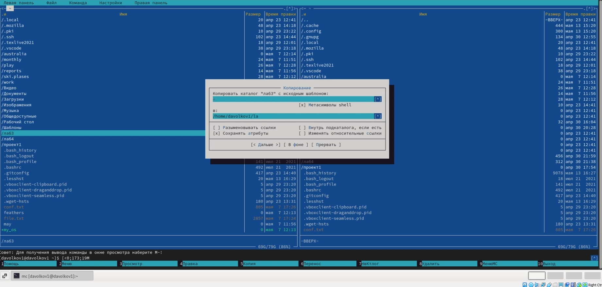

## Задание по mc
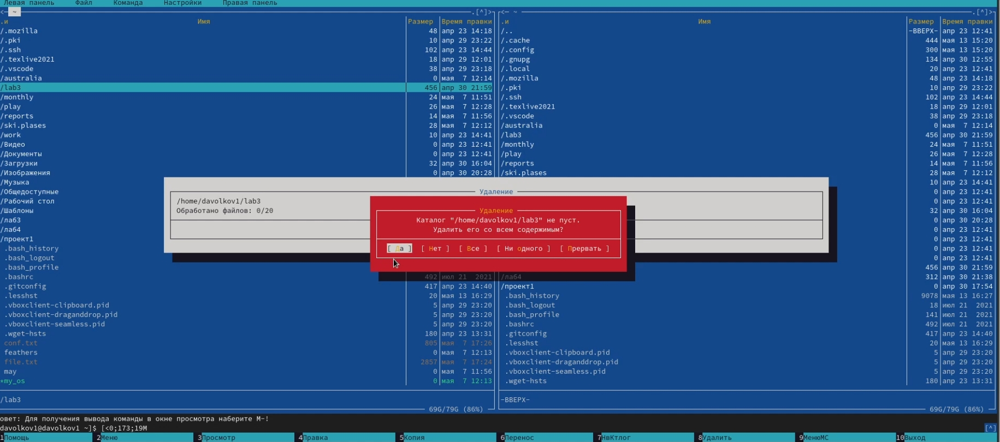

## Задание по mc
4.Выполяем основные команды меню левой (или правой) панели. Оцениваем степень подробности вывода информации о файлах.(Выдается подробная информация о файлах, а именно размер файла, владелец, права доступа и нахождение файла)

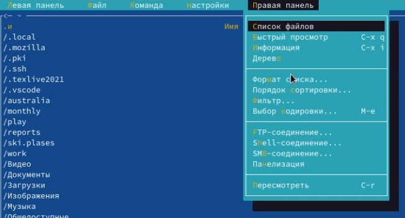

## Задание по mc
5.Используя возможности подменю 'Файл' выполняем следующие действия: Просмотр содержимого файла, редактирование файла, создание каталога, копирование файлов.

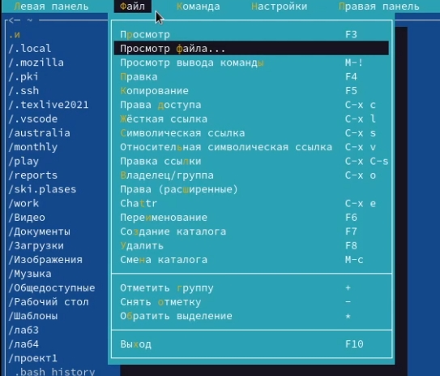

## Задание по mc
6.С помощью соответствующих средств подменю 'Команда' осуществляем следующие действия: поиск в файловой системе, повторение предыдущих команд, переход в домашний каталог, анализ файла меню и файла расширений

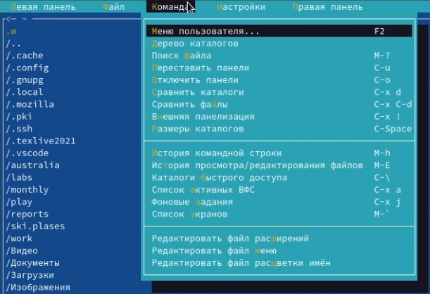

## Задание по mc
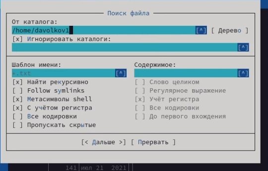

## Задание по mc
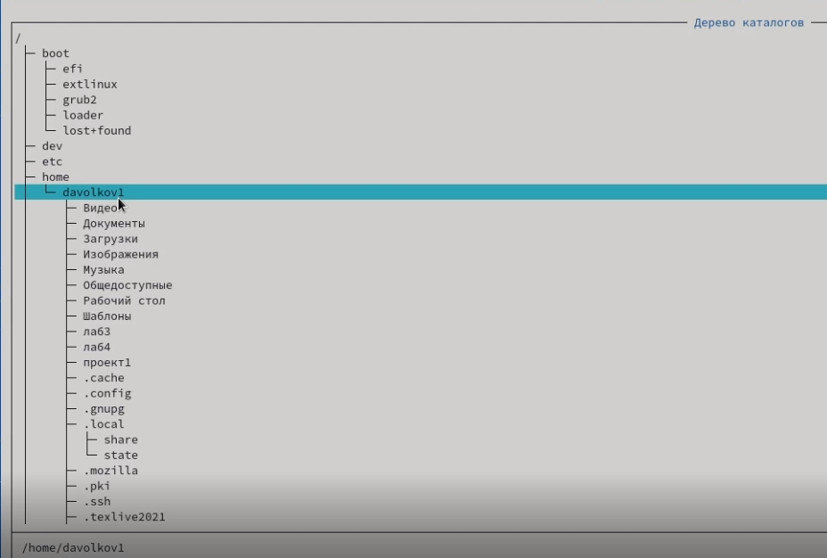

## Задание по mc
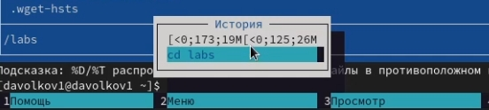

## Задание по mc
7.Вызываем подменю 'Настройки' и осваиваем операциии, определяющие структуру экрана mc.

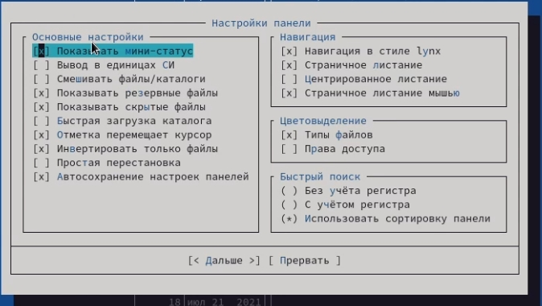

## Задание по mc
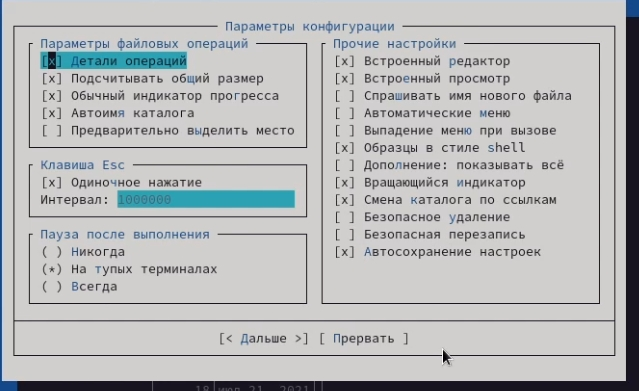

## Задание по встроенному редактору mc
1.Создаем  текстовой файл text.txt, с помощью команды touch

2.Открываем этот файл с помощью встроенного в mc редактора.

## Задание по встроенному редактору mc
3.Вставляем в открытый файл небольшой фрагмент текста, скопированный из любого
другого файла или Интернета.

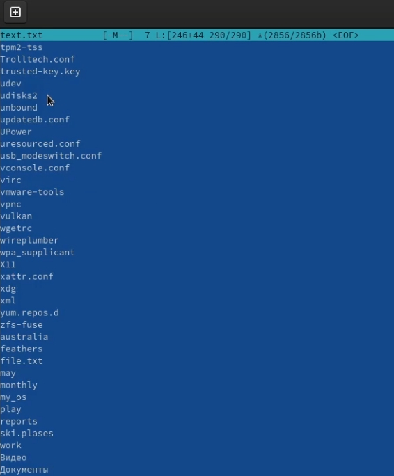

## Задание по встроенному редактору mc
4.Выполняем список действий, описанных в лабораторной работе(удаляем строку, копируем фрагмент текста, сохраняем файл и тд.)

Клавиши| Описание
------ | ---------
Ctrl-y | удалить строку
Ctrl-u | отмена последней операции
Ins    | вставка/замена
F7     | поиск (можно использовать регулярные выражения)
-F7    | повтор последней операции поиска
F4     | замена
F3     | первое нажатие — начало выделения, второе — окончание выделения
F5     | копировать выделенный фрагмент
F6     | переместить выделенный фрагмент
F8     | удалить выделенный фрагмент
F2     | записать изменения в файл
F10    | выйти из редактора
Таблица 1  

## Задание по встроенному редактору mc
5.Открываем файл с исходным текстом на некотором языке программирования (например C или Java)

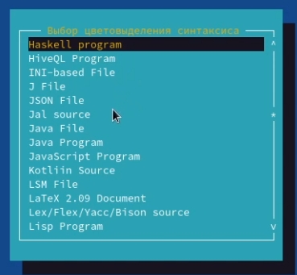

## Задание по встроенному редактору mc
6.Используя меню редактора, выключаем подсветку синтаксиса.

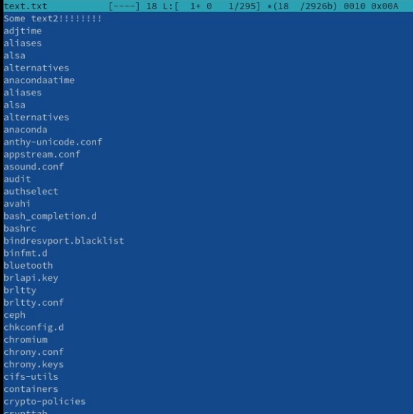

## Вывод 
В результате данной лабораторной работы, мы освоили основные возможности командной оболочки Midnight Commander, а также приобрели навыки практической работы по просмотру каталогов и файлов; манипуляций
с ними.