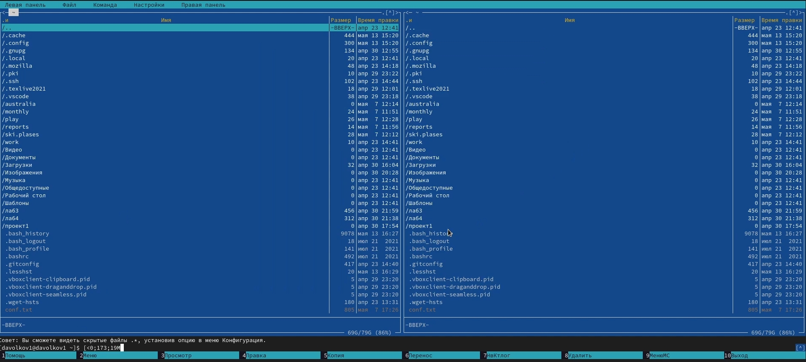
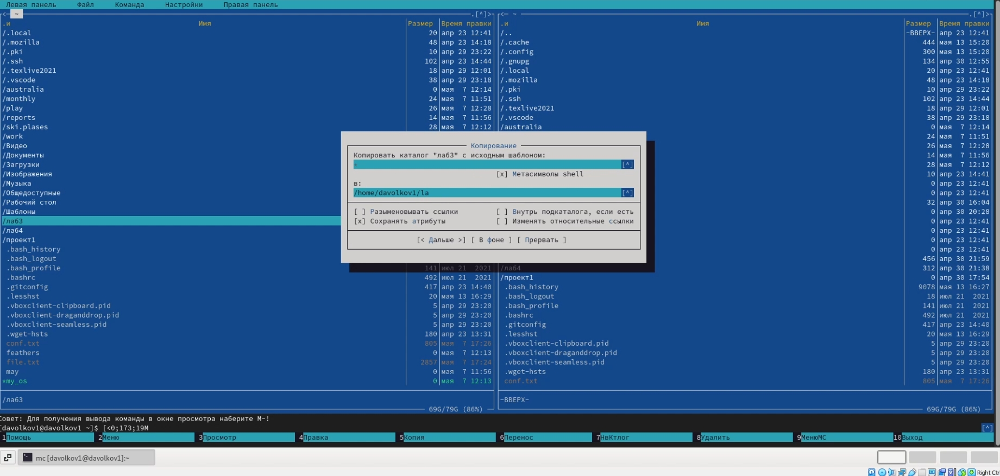
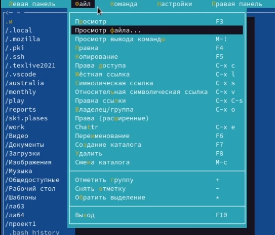
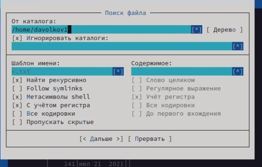
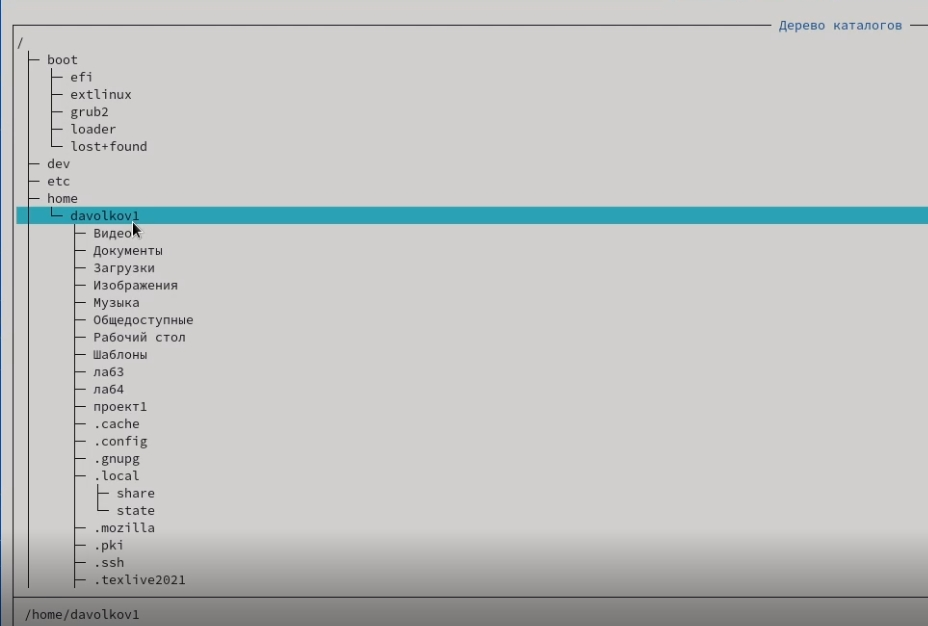
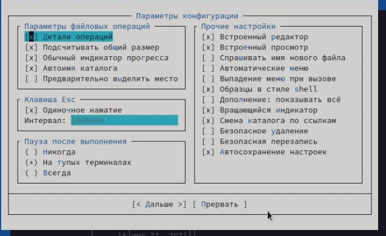
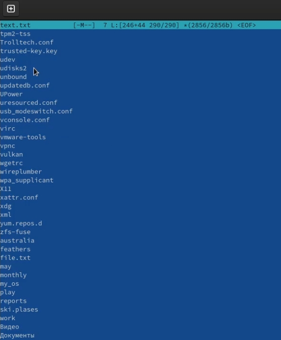

---
## Front matter
title: "Отчет к лабораторной работе №7"
subtitle: "Командная оболочка Midnight Commander"
author: "Волков Денис Александрович"

## Generic otions
lang: ru-RU
toc-title: "Содержание"

## Bibliography
bibliography: bib/cite.bib
csl: pandoc/csl/gost-r-7-0-5-2008-numeric.csl

## Pdf output format
toc: true # Table of contents
toc-depth: 2
lof: true # List of figures
lot: true # List of tables
fontsize: 12pt
linestretch: 1.5
papersize: a4
documentclass: scrreprt
## I18n polyglossia
polyglossia-lang:
  name: russian
  options:
	- spelling=modern
	- babelshorthands=true
polyglossia-otherlangs:
  name: english
## I18n babel
babel-lang: russian
babel-otherlangs: english
## Fonts
mainfont: PT Serif
romanfont: PT Serif
sansfont: PT Sans
monofont: PT Mono
mainfontoptions: Ligatures=TeX
romanfontoptions: Ligatures=TeX
sansfontoptions: Ligatures=TeX,Scale=MatchLowercase
monofontoptions: Scale=MatchLowercase,Scale=0.9
## Biblatex
biblatex: true
biblio-style: "gost-numeric"
biblatexoptions:
  - parentracker=true
  - backend=biber
  - hyperref=auto
  - language=auto
  - autolang=other*
  - citestyle=gost-numeric
## Pandoc-crossref LaTeX customization
figureTitle: "Рис."
tableTitle: "Таблица"
listingTitle: "Листинг"
lofTitle: "Список иллюстраций"
lotTitle: "Список таблиц"
lolTitle: "Листинги"
## Misc options
indent: true
header-includes:
  - \usepackage{indentfirst}
  - \usepackage{float} # keep figures where there are in the text
  - \floatplacement{figure}{H} # keep figures where there are in the text
---
# Цель работы 
Освоение основных возможностей командной оболочки Midnight Commander. Приобретение навыков практической работы по просмотру каталогов и файлов; манипуляций
с ними.

# Выполнение работы
## Задание по mc
1.Изучаем информацию о mc, вызвав в командной строке man mc.

2.Запускаем из командной строки mc, изучаем его структуру и меню.

3.Выполняем несколько операций в mc, используя управляющие клавиши (операции
с панелями; выделение/отмена выделения файлов, копирование/перемещение файлов, получение информации о размере и правах доступа на файлы и/или каталоги
и т.п.)

4.Выполяем основные команды меню левой (или правой) панели. Оцениваем степень подробности вывода информации о файлах.(Выдается подробная информация о файлах, а именно размер файла, владелец, права доступа и нахождение файла)

5.Используя возможности подменю 'Файл' выполняем следующие действия: Просмотр содержимого файла, редактирование файла, создание каталога, копирование файлов.

6.С помощью соответствующих средств подменю 'Команда' осуществляем следующие действия: поиск в файловой системе, повторение предыдущих команд, переход в домашний каталог, анализ файла меню и файла расширений

7.Вызываем подменю 'Настройки' и осваиваем операциии, определяющие структуру экрана mc.

## Задание по встроенному редактору mc
1.Создаем  текстовой файл text.txt, с помощью команды touch

2.Открываем этот файл с помощью встроенного в mc редактора.

3.Вставляем в открытый файл небольшой фрагмент текста, скопированный из любого
другого файла или Интернета.

4.Выполняем список действий, описанных в лабораторной работе(удаляем строку, копируем фрагмент текста, сохраняем файл и тд.)

Клавиши| Описание
------ | ---------
Ctrl-y | удалить строку
Ctrl-u | отмена последней операции
Ins    | вставка/замена
F7     | поиск (можно использовать регулярные выражения)
-F7    | повтор последней операции поиска
F4     | замена
F3     | первое нажатие — начало выделения, второе — окончание выделения
F5     | копировать выделенный фрагмент
F6     | переместить выделенный фрагмент
F8     | удалить выделенный фрагмент
F2     | записать изменения в файл
F10    | выйти из редактора
Таблица 1  

5.Открываем файл с исходным текстом на некотором языке программирования (например C или Java)

6.Используя меню редактора, выключаем подсветку синтаксиса.

# Вывод 
В результате данной лабораторной работы, мы освоили основные возможности командной оболочки Midnight Commander, а также приобрели навыки практической работы по просмотру каталогов и файлов; манипуляций
с ними.

# Контрольные вопросы 
1. Режим просмотра файлов. Этот режим используется для просмотра списка файлов. Существует четыре таких режима: Full, Brief, Long и User. В режиме Full отображается имя файла, размер файла и время последней модификации. В режиме Brief список файлов располагается в две колонки и состоит только из имён файлов (поэтому в этом режиме отображается наибольшее количество файлов, по сравнению с другими режимами). Режим Long идентичен результату выполнения команды ls -l. В этом режиме панель занимает весь экран. При использовании режима User нужно указать параметр формата отображения.Этот параметр должен начинаться со спецификации размера панели: “half” или “full” (при выборе full панель будет во весь экран, а при half - лишь в половину )
2. Например, скопировать файл можно используя комбинацию клавиш в mc или с помощью команды cp; перейти в дргой каталог/директорию можно через команды cd или используя mc и стрелочки; удалить файл можно через rm -r “название файла” или F8
3. Панели можно поменять местами. Для этого и используется комбинация клавиш Ctrl-u или команда меню mc Переставить панели. Также можно временно убрать отображение панелей (отключить их) с помощью комбинации клавиш Ctrl-o или команды меню mc. Отключить панели . Это может быть полезно, например, если необходимо увидеть вывод какой-то информации на экран после выполнения какой-либо команды shell. С помощью последовательного применения комбинации клавиш Ctrl-x d есть возможность сравнения каталогов,отображённых на двух панелях. Панели могут дополнительно быть переведены в один из двух режимов: Информация или Дерево. В режиме Информация на панель выводятся сведения о файле и текущей файловой системе, расположенных на активной панели. В режиме Дерево на одной из панелей выводится структура дерева каталогов. Управлять режимами отображения панелей можно через пункты меню mc “Правая панель и Левая панель”.Перейти в строку меню панелей mc можно с помощью функциональной клавиши F9. В строке меню имеют сяпять меню: Левая панель , Файл , Команда , Настройки и Правая панель. Подпунктменю Быстрый просмотр позволяет выполнить быстрый просмотр содержимого панели.Подпункт меню Информация позволяет посмотреть информацию о файле или каталогеВ меню каждой (левой или правой) панели можно выбрать Формат списка : стандартный — выводит список файлов и каталогов с указанием размера и времени правки; ускоренный — позволяет задать число столбцов,на которые разбивается панель при выводе списка имён файлов или каталогов без дополнительной информации; расширенный — помимо названия файла или каталога выводит сведения о правах доступа,владельце,группе,размере,времени правки; определённый пользователем — позволяет вывестите сведения о файле или каталоге, которые задаст сам пользователь. Подпункт меню Порядок сортировки позволяет задать критерии сортировки при выводе списка файлов и каталогов: без сортировки, по имени, расширенный, время правки, время доступа,время изменения атрибута,размер, узел
4. В меню Файл содержит перечень команд, которые могут быть применены к одному или нескольким файлам или каталогам. Команды меню Файл: Просмотр ( F3 ) — позволяет посмотреть содержимое текущего (или выделенного) файла без возможности редактирования.Просмотр вывода команды ( М + ! ) — функция запроса команды с параметрами(аргумент ктекущему выбранному файлу). Правка ( F4 )—открываеттекущий (или выделенный) файл для его редактирования. Копирование ( F5 )—осуществляет копирование одного или нескольких файлов или каталогов в указанное пользователем во всплывающем окне место. Права доступа ( Ctrl-x c ) — позволяет указать (изменить) права доступа к одному или нескольким файлам или каталогам. Жёсткая ссылка ( Ctrl-x l ) — позволяет создать жёсткую ссылку к текущему (или выделенному) файлу.Символическая ссылка ( Ctrl-x s )—позволяет создать символическую ссылку к текущему (или выделенному) файлу. Владелец/группа ( Ctrl-x o )—позволяет задать (изменить) владельца и имя группы для одного или нескольких файлов или каталогов. Права (расширенные)—позволяет изменить права доступа и владения для одного или нескольких файлов или каталогов. Переименование ( F6 ) — позволяет переименовать (или переместить) один или несколько файлов или каталогов. Создание каталога ( F7 )—позволяет создать каталог. Удалить ( F8 )—позволяет удалить один или несколько файлов или каталогов. Выход ( F10 )—завершает работу mc
5. В меню Команда содержатся более общие команды для работы с mc.Команды меню Команда: Дерево каталогов—отображает структуру каталогов системы. Поиск файла—выполняет поиск файлов по заданным параметрам.Переставить панели—меняет местами левую и правую панели. Сравнить каталоги ( Ctrl-x d )—сравнивает содержимое двух каталогов. Размеры каталогов—отображает размер и время изменения каталога (по умолчанию в mc размер каталога корректно не отображается).История командной строки — выводит на экран список ранее выполненных в оболочке команд. Каталоги быстрого доступа ( Ctrl- )—пр вызове выполняется быстрая смена текущего каталога на один из заданного списка. Восстановление файлов—позволяет восстановить файлы на файловых системах ext2 и ext3. Редактировать файл расширений—позволяет задать с помощью определённого синтаксиса действия при запуске файлов с определённым расширением. Редактировать файл меню—позволяет отредактировать контекстное меню пользователя,вызываемое по клавише F2. Редактировать файл расцветки имён — позволяет подобрать оптимальную для пользователя расцветку имён файлов в зависимости от их типа.
6. Меню Настройки содержитряд дополнительных опций по внешнему виду и функциональности mc. Меню Настройки содержит:Конфигурация—позволяет скорректировать настройки работы с панелями.Внешний вид и Настройки панелей—определяет элементы (строка меню,командная строка,подсказки и прочее),отображаемые при вызове mc,атакже геометрию расположения панелей и цветовыделение. Биты символов—задаёт формат обработки информации локальным терминалом. Подтверждение—позволяет установить или убрать вывод окна с запросом подтверждения действий при операциях удаления и перезаписи файлов,атакже при выходе из программы. Распознание клавиш — диалоговое окно используется для тестирования функциональных клавиш,клавиш управления курсором и прочее. Виртуальные ФС –– настройки виртуальной файловой системы: тайм-аут, пароль и прочее
7. F1 - Вызов контекстно-зависимой подсказки. F2 - Вызов пользовательского меню с возможностью создания и/или дополнения дополнительных функций. F3 - Просмотр содержимого файла, на который указывает подсветка в активной панели (без возможности редактирования). F4 - Вызов встроенного в mc редактора для изменения содержания файла, на который указывает подсветка в активной панели. F5 - Копирование одного или нескольких файлов, отмеченных в первой (активной) панели,в каталог,отображаемый на второй панели. F6 - Перенос одного или нескольких файлов,отмеченных в первой (активной) панели, в каталог, отображаемый на второй панели. F7 - Создание подкаталога в каталоге,отображаемом в активной панели. F8 - Удаление одного или нескольких файлов(каталогов), отмеченных в первой (активной) панели файлов. F9 - Вызов меню mc. F10 - Выход из mc
8. См. пункт 4, Таблица 1
9. С помощью последовательного применения комбинации клавиш Ctrl-x d есть возможность сравнения каталогов,отображённых на двух панелях.Панели могут дополнительно быть переведены в один из двух режимов: Информация или Дерево. В режиме Информация на панель выводятся сведения о файле и текущей файловой системе, расположенных на активной панели. В режиме Дерево на одной из панелей выводится структура дерева каталогов.Управлять режимами отображения панелей можно через пункты меню mc Правая панель и Левая панель
10. Встроенный в mc редактор вызывается с помощью функциональной клавиши F4. В нём удобно использовать различные комбинации клавиш при редактировании содержимого(как правилотекстового) файла. В меню Файл содержитперечень команд,которые могутбыть применены к одному или нескольким файлам или каталогам 