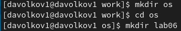
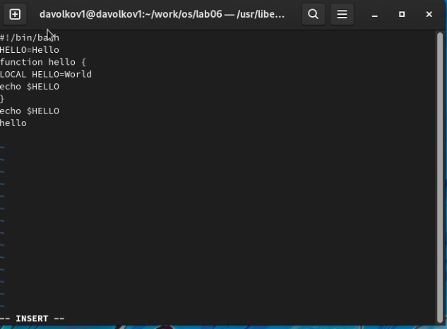

---
## Front matter
lang: ru-RU
title: Текстовой редактор vi
author: |
  Волков Денис Александрович, НПИ-01-21, 1032216533
institute: |
	\inst{1}RUDN University, Moscow, Russian Federation
date: 14 May, 2022

## Formatting
toc: false
slide_level: 2
theme: metropolis
header-includes: 
 - \metroset{progressbar=frametitle,sectionpage=progressbar,numbering=fraction}
 - '\makeatletter'
 - '\beamer@ignorenonframefalse'
 - '\makeatother'
aspectratio: 43
section-titles: true
---
## Цель работы 
Познакомиться с операционной системой Linux. Получить практические навыки работы с редактором vi, установленным по умолчанию практически во всех дистрибутивах.
с ними.

# Выполнение работы
## Задание 1. Создание нового файла с использованием vi
1.Создаем каталог с именем ~/work/os/lab06.



## Задание 1. Создание нового файла с использованием vi
2.Переходим в созданный каталог


## Задание 1. Создание нового файла с использованием vi
3.Вызываем vi и создаем файл hello.sh:  

`  vi hello.sh `

## Задание 1. Создание нового файла с использованием vi
4.Нажимаем клавишу i и вводим следующий текст:

```
#!/bin/bash
HELL=Hello
function hello {
LOCAL HELLO=World
echo $HELLO
}
echo $HELLO
hello 
```

## Задание 1. Создание нового файла с использованием vi
5.Нажимаем клавишу Esc для перехода в командный режим после завершения ввода текста.

6.Нажимаем ' : ' для перехода в режим последней строки и внизу экрана появится приглашение в виде двоеточия.

7.Нажимаем ' w ' и ' q ', а затем клавишу Enter для сохранения текста и завершения работы.

8.Делаем файл исполняемым ` chmod +x hello.sh `

## Задание 2. Редактирование существующего файла
1.Вызываем vi на редактирование файла 
` vi ~/work/os/lab06/hello.sh`

2.Устанавливаем курсор в конец слова HELL второй строки.

## Задание 2. Редактирование существующего файла
3.Переходим в режим вставки и замените на HELLO. Нажимаем Esc для возврата в командный режим.



## Задание 2. Редактирование существующего файла
4.Устанавливаем курсор на четвертую строку и стираем слово LOCAL.

5.Переходим в режим вставки и набераем следующий текст: local, нажмаем Esc для
возврата в командный режим.

6.Установите курсор на последней строке файла. Вставьте после неё строку, содержащую
следующий текст: echo $HELLO.

## Задание 2. Редактирование существующего файла
7.Нажмаем Esc для перехода в командный режим.

8.Удаляем последнюю строку.

9.Вводим команду отмены изменений u для отмены последней команды.

10.Вводим символ ' : ' для перехода в режим последней строки. Записывем произведённые
изменения и выходим из vi.

## Вывод 
В ходе лабораторной работы мы познакомились с операционной системой Linux.Получили практические навыки работы с редактором vi,установленным по умолчанию практически во всех дистрибутивах