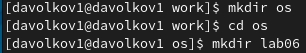
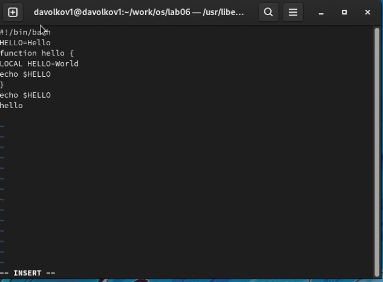

---
## Front matter
title: "Отчет к лабораторной работе №8"
subtitle: "Текстовой редактор vi"
author: "Волков Денис Александрович"

## Generic otions
lang: ru-RU
toc-title: "Содержание"

## Bibliography
bibliography: bib/cite.bib
csl: pandoc/csl/gost-r-7-0-5-2008-numeric.csl

## Pdf output format
toc: true # Table of contents
toc-depth: 2
lof: true # List of figures
lot: true # List of tables
fontsize: 12pt
linestretch: 1.5
papersize: a4
documentclass: scrreprt
## I18n polyglossia
polyglossia-lang:
  name: russian
  options:
	- spelling=modern
	- babelshorthands=true
polyglossia-otherlangs:
  name: english
## I18n babel
babel-lang: russian
babel-otherlangs: english
## Fonts
mainfont: PT Serif
romanfont: PT Serif
sansfont: PT Sans
monofont: PT Mono
mainfontoptions: Ligatures=TeX
romanfontoptions: Ligatures=TeX
sansfontoptions: Ligatures=TeX,Scale=MatchLowercase
monofontoptions: Scale=MatchLowercase,Scale=0.9
## Biblatex
biblatex: true
biblio-style: "gost-numeric"
biblatexoptions:
  - parentracker=true
  - backend=biber
  - hyperref=auto
  - language=auto
  - autolang=other*
  - citestyle=gost-numeric
## Pandoc-crossref LaTeX customization
figureTitle: "Рис."
tableTitle: "Таблица"
listingTitle: "Листинг"
lofTitle: "Список иллюстраций"
lotTitle: "Список таблиц"
lolTitle: "Листинги"
## Misc options
indent: true
header-includes:
  - \usepackage{indentfirst}
  - \usepackage{float} # keep figures where there are in the text
  - \floatplacement{figure}{H} # keep figures where there are in the text
---
# Цель работы 
Познакомиться с операционной системой Linux. Получить практические навыки работы с редактором vi, установленным по умолчанию практически во всех дистрибутивах.
с ними.

# Выполнение работы
## Задание 1. Создание нового файла с использованием vi
1.Создаем каталог с именем ~/work/os/lab06.



2.Переходим в созданный каталог


3.Вызываем vi и создаем файл hello.sh:  

`  vi hello.sh `

4.Нажимаем клавишу i и вводим следующий текст:

```
#!/bin/bash
HELL=Hello
function hello {
LOCAL HELLO=World
echo $HELLO
}
echo $HELLO
hello 
```

5.Нажимаем клавишу Esc для перехода в командный режим после завершения ввода текста.

6.Нажимаем ' : ' для перехода в режим последней строки и внизу экрана появится приглашение в виде двоеточия.

7.Нажимаем ' w ' и ' q ', а затем клавишу Enter для сохранения текста и завершения работы.

8.Делаем файл исполняемым ` chmod +x hello.sh `

## Задание 2. Редактирование существующего файла
1.Вызываем vi на редактирование файла 
` vi ~/work/os/lab06/hello.sh`

2.Устанавливаем курсор в конец слова HELL второй строки.

3.Переходим в режим вставки и замените на HELLO. Нажимаем Esc для возврата в командный режим.



4.Устанавливаем курсор на четвертую строку и стираем слово LOCAL.

5.Переходим в режим вставки и набераем следующий текст: local, нажмаем Esc для
возврата в командный режим.

6.Установите курсор на последней строке файла. Вставьте после неё строку, содержащую
следующий текст: echo $HELLO.

7.Нажмаем Esc для перехода в командный режим.

8.Удаляем последнюю строку.

9.Вводим команду отмены изменений u для отмены последней команды.

10.Вводим символ ' : ' для перехода в режим последней строки. Записывем произведённые
изменения и выходим из vi.

# Вывод 
В ходе лабораторной работы мы познакомились с операционной системой Linux.Получили практические навыки работы с редактором vi,установленным по умолчанию практически во всех дистрибутивах

# Контрольные вопросы 
1. Редактор vi имеет три режима работы:
* командный режим – предназначен для ввода команд редактирования и навигации по редактируемому файлу
* режим вставки – предназначен для ввода содержания редактируемого файла
* режим последней (или командной) строки – используется для записи изменений в файл и выхода из редактора
2. Введя команду :q! в командном режиме.
* 0 – переход в начало строки
* $ – переход в конец строки
* G– переход в конец файла
* 𝑛G — переход на строку с номером n (например 9G)
4.	В зависимости от используемой команды редактор vi понимает слово по-разному. При использовании прописных W и B под разделителями понимаются только пробел, табуляция и возврат каретки. При использовании строчных w и b под разделителями понимаются также любые знаки пунктуации.
5. 
*	gg – переход в начало файла
*	G – переход в конец файла
6. 
* Вставка текста текста позволяет вставить текст относительно курсора или строки (n раз)
* Вставка строки позволяет вставить строку относительно курсора
* Удаление текста позволяет удалять текст посимвольно, относительно курсора, относительно строки и номерам строк
* Отмена и повтор произведенных изменений позволяет отменить и повторить произведенные изменения
* Копирование текста позволяет скопировать строку, n строк или слово в буфер
* Вставка текста позволяет вставить текст из буфера относительно курсора
* Замена текста позволяет заменить текст или слова
* Поиск текста позволяет произвести поиск текста внутри файла
7. Можем использовать ` 10A$Esc `
8. Командой u.
9. 	
* Команды копирования и перемещения текста позволяют удалять, перемещать и копировать текст (строки), а также записывать их в отдельный файл
* Команды записи файла и выхода из редактора позволяют записать измененный текст как с выходом из редактора, так и без, а также выйти из редактора без записи изменений.
10. Использовав команду $
11. Используя команду ` :help ` можем узнать назначение опций.
12. Посмотрев на последнюю строку